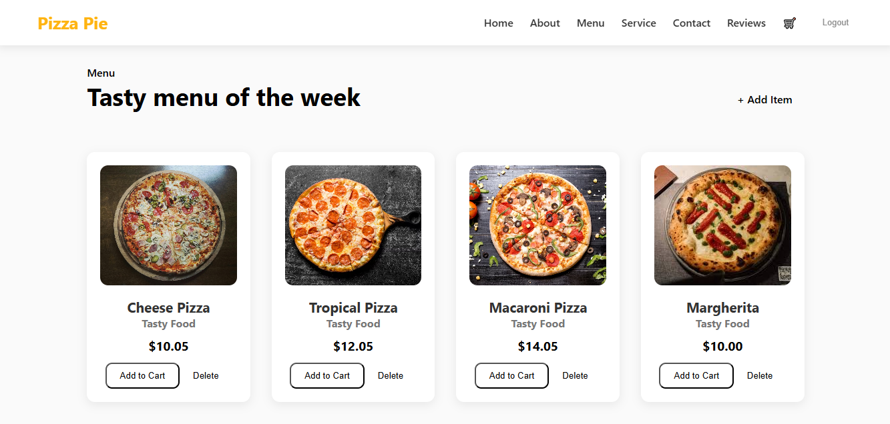
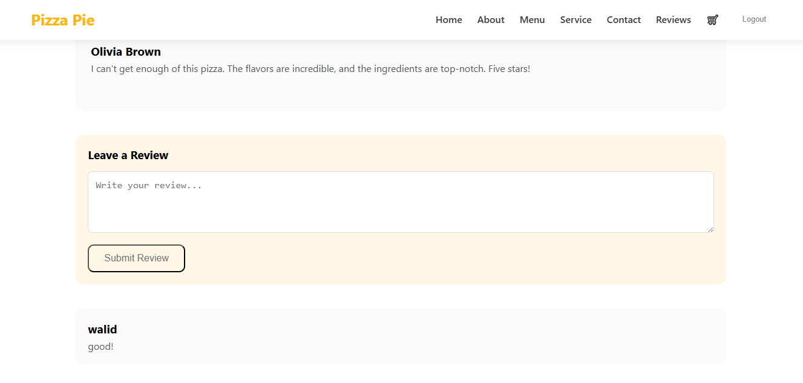

# PizzaPie Web App 🍕

## Project Description
PizzaPie is a full-stack web app for browsing, adding, and ordering pizza menu items. Admins can manage the menu, and users can add items to their cart and checkout. The app features authentication, a responsive UI, and database-driven content.

**Key Features:**
- Browse pizza menu with images and prices
- Add items to cart
- Admin authentication for managing menu
- Add/Delete menu items (admin only)
- User registration and login
- Review system for menu items

---

## Technologies Used
- **Frontend:** React, React Router, Axios, CSS  
- **Backend:** Node.js, Express, MySQL, Multer, Bcrypt  
- **Hosting:** GitHub Pages (frontend), Render (backend)  
- **Version Control:** Git & GitHub

---

## Setup Instructions

### Prerequisites
- Node.js (v18+ recommended)  
- npm  
- MySQL

### Backend Setup
```bash
git clone https://github.com/tasneem987/PizzaPie.git
cd PizzaPie/pizza-database
npm install


## Screenshots

### Home Page


### Menu Page


### Add Item Page


### Cart Page


### Reviews


